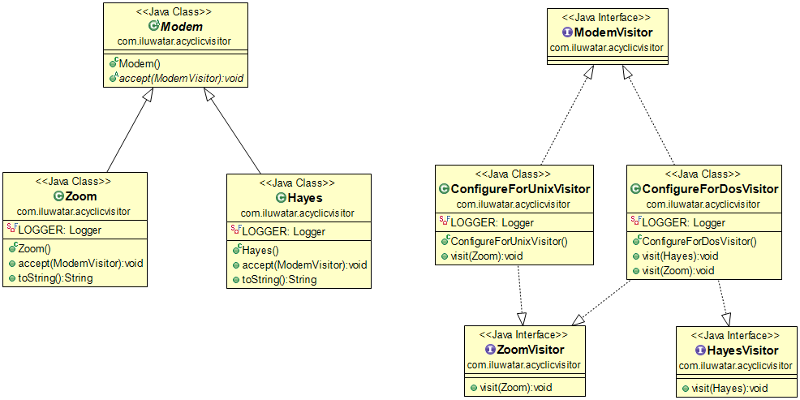

## Intent
Allow new functions to be added to existing class hierarchies without affecting those hierarchies, and without creating the troublesome dependency cycles that are inherent to the GOF VISITOR Pattern.

## Applicability
This pattern can be used:
* When you need to add a new function to an existing hierarchy without the need to alter or affect that hierarchy.
* When there are functions that operate upon a hierarchy, but which do not belong in the hierarchy itself. e.g. the ConfigureForDOS / ConfigureForUnix / ConfigureForX issue.
* When you need to perform very different operations on an object depending upon its type.
* When the visited class hierarchy will be frequently extended with new derivatives of the Element class.
* When the recompilation, relinking, retesting or redistribution of the derivatives of Element is very expensive.

## Consequences
The good:
* No dependency cycles between class hierarchies.
* No need to recompile all the visitors if a new one is added.
* Does not cause compilation failure in existing visitors if class hierarchy has a new member.

The bad:
* Violates the principle of least surprise or Liskov's Substitution principle by showing that it can accept all visitors but actually only being interested in particular visitors.
* Parallel hierarchy of visitors has to be created for all members in visitable class hierarchy.

## Related patterns
* [Visitor Pattern](../visitor/README.md)

## Credits
* [Acyclic Visitor](http://condor.depaul.edu/dmumaugh/OOT/Design-Principles/acv.pdf)